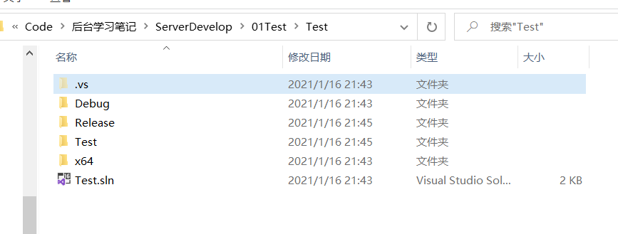
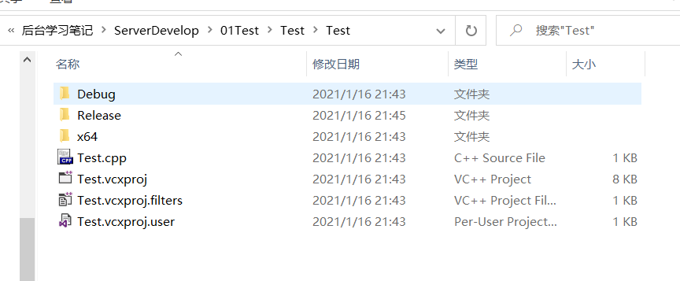
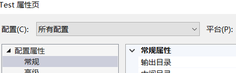
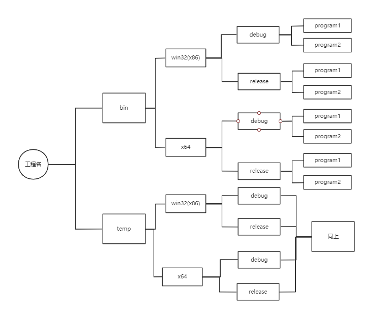

## 有关Visual Stdio的配置

#### 1.运行导出的文件过乱

因为每次运行无论是那种模式下的项目，都会产生一个Debug或Release包，分别在存储目录下和项目文件下。

1.存储目录下：

2.项目文件下：

这样子就会使文件结构很乱无法区分哪些是临时文件

##### 修改方法

所以我们这里要对配置进行修改。

右键项目然后选择属性；

将配置改为所有配置,平台改为所有平台。

可以看到

我们将输出目录修改为

**输出目录**

~~~cpp
$(SolutionDir)../bin/$(Platform)/$(Configuration)
~~~

解决目录/bin目录/平台t(x86/x64)/配置(debug/release)

**临时目录**

~~~c++
$(SolutionDir)../temp/$(Platform)/$(Configuration)/$(ProjectName)
~~~

解决目录/temp目录/平台t(x86/x64)/配置(debug/release)/项目名

最后就会形成一个这样的目录树

#### **2.执行项目**

如果一个工程下有两个项目，则要执行哪一个就要把那个项目设为启动项。