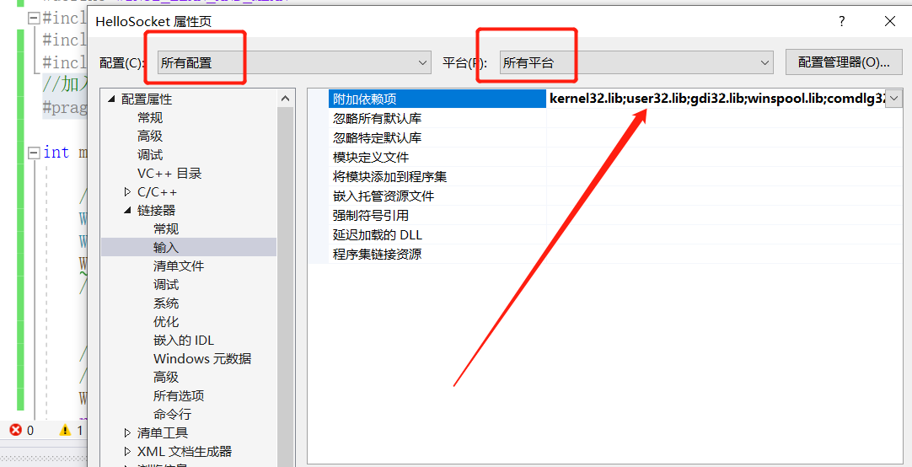

## Socket网络编程基础

#### 1.修改WinSock2.h和windows.h冲突

##### 方法一：

~~~cpp
#include <WinSock2.h>
#include <windows.h>
~~~

必须要WinSock2.h在前面才能避免宏冲突

但是这种写法在工程量比较大的时候无法保证WinSock2.h一定在windows.h之前

##### 方法二：

在代码最开始加入宏定义

~~~cpp
#define WIN32_LEAN_AND_MEAN
~~~

然后开始编写代码：

#### 2.启动socket连接

~~~c++
//启动Windows socket 2.x环境
WORD ver = MAKEWORD(2,2); //2.2版本
WSADATA dat;	  
WSAStartup(ver,&dat); //winsocket的启动函数 版本号
~~~

#### 3.关闭socket连接

~~~cpp
//清除Windows socket 环境
WSACleanup();//关闭socket连接
~~~

#### 4.加入静态库文件（解决WSAStartup(ver,&dat);报错）

不然在WSAStartup(ver,&dat);会报错（这是第一种写法，只能在window系统里，所以不建议使用）

~~~cpp
//加入静态链接库文件
#pragma comment(lib,"ws2_32.lib")
~~~

所以我们去工程属性，将ws2_32.lib加入到下面的位置

#### 5.查看dat的信息

通过调试可以看到生成的dat的信息

是WinSock 2.0和我们需要的版本相同。

#### 用Socket API 建立简易TCP服务端

> 1.建立一个socket
> 2.绑定接受客户端连接的端口 bind
> 3.监听网络端口 listen
> 4.等待接受客户端连接 accept
> 5.向客户端发送一条数据send
> 6.关闭socket close socket

##### 1.建立一个socket

~~~cpp
//1.建立一个socket(套接字)
SOCKET _sock = socket(AF_INET,SOCK_STREAM,IPPROTO_TCP);//AF_INET:IPV4 SOCK_STREAM:面向流的socket类型 IPPROTO_TCP:TCP形式
~~~

##### 2.绑定接受客户端连接的端口 bind

~~~cpp
//2.绑定接受客户端连接的端口 bind
sockaddr_in _sin = {};
_sin.sin_family = AF_INET; //IPV4类型
_sin.sin_port =htons(4567); //端口号 host to net unsigned short 将主机的数据转为网络的数据
_sin.sin_addr.S_un.S_addr = INADDR_ANY;//服务器绑定的ip地址，一个主机可能有多个ip地址 写法1：inet_addr("192.168.31.203") 写法2：INADDR_ANY(启动所有点ip地址)
if (bind(_sock, (sockaddr*)&_sin, sizeof(sockaddr_in)) == SOCKET_ERROR) {
	std::cout<<"error,绑定接受客户端连接的端口失败...."<< std::endl;
}
else {
	std::cout << "绑定接受客户端连接的端口成功...." << std::endl;
}
~~~

##### 3.监听网络端口 listen

~~~cpp
//3.监听网络端口 listen
if (listen(_sock, 5) == SOCKET_ERROR) {//最大等待5个人连接
	std::cout << "error,监听网络端口失败...." << std::endl;
}
else {
	std::cout << "监听网络端口成功...." << std::endl;
}
~~~

##### 4.等待接受客户端连接 accept

~~~cpp
//4.等待接受客户端连接 accept
sockaddr_in ClientAddr = {};
int nAddrLen = sizeof(sockaddr_in);
SOCKET _cSock = INVALID_SOCKET;
char msgBuf[] = "Hello, I'm Server.";
_cSock = accept(_sock, (sockaddr*)&ClientAddr, &nAddrLen); //当客户端连接我们的时候，我们就可以收到ClientAddr(socket数据)和nAddrLen(socket数据的长度)
if (_cSock == INVALID_SOCKET) {
	std::cout << "warning,接受到无效客户端SOCKET...." << std::endl;
}
std::cout << "新客户端加入:IP=" <<inet_ntoa(ClientAddr.sin_addr)<< std::endl;
~~~

inet_ntoa需要宏定义

添加宏，右键项目，属性，C++，预处理，在预处理器定义中添加宏。

~~~cpp
_WINSOCK_DEPRECATED_NO_WARNINGS
~~~

##### 5.向客户端发送一条数据send

~~~cpp
//5.向客户端发送一条数据send
send(_cSock, msgBuf, strlen(msgBuf) + 1, 0);//发送给_cSock msgBuf信息 +1为结尾符
~~~

##### 6.关闭socket close socket

~~~cpp
//6.关闭socket close socket
	closesocket(_sock);
~~~

#### 用Socket API 建立简易TCP客户端

>1.建立一个socket
>2.连接服务器 connect
>3.接受服务器信息 recv
>4.关闭socket close socket

##### 1.建立一个socket

~~~cpp
//1.建立一个socket
SOCKET _sock = socket(AF_INET, SOCK_STREAM, 0);//AF_INET:IPV4
if (INVALID_SOCKET == _sock) {
	std::cout << "error,建立套接字失败...." << std::endl;
}
else {
	std::cout << "建立套接字成功...." << std::endl;
}
~~~

##### 2.连接服务器 connect

~~~cpp
//2.连接服务器 connect
sockaddr_in _sin = {};
_sin.sin_family = AF_INET;
_sin.sin_port = htons(4567);
_sin.sin_addr.S_un.S_addr = inet_addr("192.168.31.203");
int ret = connect(_sock, (sockaddr*)&_sin,sizeof(sockaddr_in));
if (SOCKET_ERROR == ret) {
	std::cout << "error,连接失败...." << std::endl;
}
else {
	std::cout << "建立连接成功...." << std::endl;
}
~~~

这里inet_addr可能会报错，记得按以下两种方法去修改

**方法一**

将SDL检查修改为否

**方法二**

在代码中添加

~~~cpp
#define _WINSOCK_DEPRECATED_NO_WARNINGS 0
~~~

如果上面两个都不行，则记得看看代码是否添加

~~~cpp
#pragma comment(lib,"ws2_32.lib")
~~~

##### 3.接受服务器信息 recv

~~~cpp
//3.接受服务器信息 recv
char recvBuf[256] = {};
int nlen = recv(_sock, recvBuf, 256, 0);
if (nlen > 0) {
	std::cout <<"接收到数据："<< recvBuf << std::endl;
}
~~~

##### 4.关闭socket close socket

~~~cpp
//4.关闭socket close socket
closesocket(_sock);
~~~

## 总代码：

**server.cpp**

~~~cpp
#define _CRT_SECURE_NO_WARNINGS
#define WIN32_LEAN_AND_MEAN

#include <iostream>
#include <windows.h>
#include <WinSock2.h>

int main(void) {

	//启动Windows socket 2.x环境
	WORD ver = MAKEWORD(2, 2); //2.2版本
	WSADATA dat;
	WSAStartup(ver, &dat); //winsocket的启动函数 版本号
	/*****************用Socket API 建立简易TCP服务端************************/
	//1.建立一个socket(套接字)
	SOCKET _sock = socket(AF_INET,SOCK_STREAM,IPPROTO_TCP);//AF_INET:IPV4 SOCK_STREAM:面向流的socket类型 IPPROTO_TCP:TCP形式
	//2.绑定接受客户端连接的端口 bind
	sockaddr_in _sin = {};
	_sin.sin_family = AF_INET; //IPV4类型
	_sin.sin_port =htons(4567); //端口号 host to net unsigned short 将主机的数据转为网络的数据
	_sin.sin_addr.S_un.S_addr = INADDR_ANY;//服务器绑定的ip地址，一个主机可能有多个ip地址 写法1：inet_addr("192.168.31.203") 写法2：INADDR_ANY(启动所有点ip地址)
	if (bind(_sock, (sockaddr*)&_sin, sizeof(sockaddr_in)) == SOCKET_ERROR) {
		std::cout<<"error,绑定接受客户端连接的端口失败...."<< std::endl;
	}
	else {
		std::cout << "绑定接受客户端连接的端口成功...." << std::endl;
	}
	//3.监听网络端口 listen
	if (listen(_sock, 5) == SOCKET_ERROR) {//最大等待5个人连接
		std::cout << "error,监听网络端口失败...." << std::endl;
	}
	else {
		std::cout << "监听网络端口成功...." << std::endl;
	}
	//4.等待接受客户端连接 accept
	sockaddr_in ClientAddr = {};
	int nAddrLen = sizeof(sockaddr_in);
	SOCKET _cSock = INVALID_SOCKET;
	char msgBuf[] = "Hello, I'm Server.";
	while (true) {
		_cSock = accept(_sock, (sockaddr*)&ClientAddr, &nAddrLen); //当客户端连接我们的时候，我们就可以收到ClientAddr(socket数据)和nAddrLen(socket数据的长度)
		if (_cSock == INVALID_SOCKET) {
			std::cout << "warning,接受到无效客户端SOCKET...." << std::endl;
		}
		std::cout << "新客户端加入:IP=" <<inet_ntoa(ClientAddr.sin_addr)<< std::endl;
		//5.向客户端发送一条数据send
		send(_cSock, msgBuf, strlen(msgBuf) + 1, 0);//发送给_cSock msgBuf信息 +1为结尾符
	}
	//6.关闭socket close socket
	closesocket(_sock);
	/*****************************************************************/
	//清除Windows socket 环境
	WSACleanup();
	return 0;
}
~~~

**client.cpp**

~~~cpp
#define _CRT_SECURE_NO_WARNINGS
#define WIN32_LEAN_AND_MEAN
#include <iostream>
#include <windows.h>
#include <WinSock2.h>
#define _WINSOCK_DEPRECATED_NO_WARNINGS 0
#pragma comment(lib,"ws2_32.lib")
int main(void) {
	//启动Windows socket 2.x环境
	WORD ver = MAKEWORD(2, 2); //2.2版本
	WSADATA dat;
	WSAStartup(ver, &dat); //winsocket的启动函数 版本号
	/*****************用Socket API 建立简易TCP客户端************************/
	//1.建立一个socket
	SOCKET _sock = socket(AF_INET, SOCK_STREAM, 0);//AF_INET:IPV4
	if (INVALID_SOCKET == _sock) {
		std::cout << "error,建立套接字失败...." << std::endl;
	}
	else {
		std::cout << "建立套接字成功...." << std::endl;
	}
	//2.连接服务器 connect
	sockaddr_in _sin = {};
	_sin.sin_family = AF_INET;
	_sin.sin_port = htons(4567);
	_sin.sin_addr.S_un.S_addr = inet_addr("192.168.31.203");
	int ret = connect(_sock, (sockaddr*)&_sin,sizeof(sockaddr_in));
	if (SOCKET_ERROR == ret) {
		std::cout << "error,连接失败...." << std::endl;
	}
	else {
		std::cout << "建立连接成功...." << std::endl;
	}
	//3.接受服务器信息 recv
	char recvBuf[256] = {};
	int nlen = recv(_sock, recvBuf, 256, 0);
	if (nlen > 0) {
		std::cout <<"接收到数据："<< recvBuf << std::endl;
	}
	//4.关闭socket close socket
	closesocket(_sock);
	/*****************************************************************/
	//清除Windows socket 环境
	WSACleanup();
	getchar();
	return 0;
}
~~~

结果

