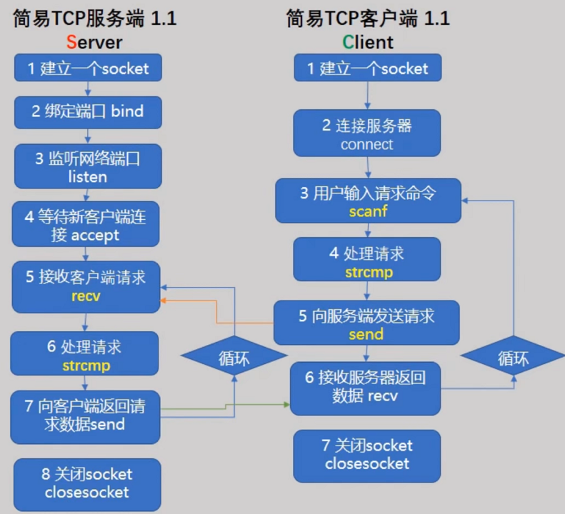
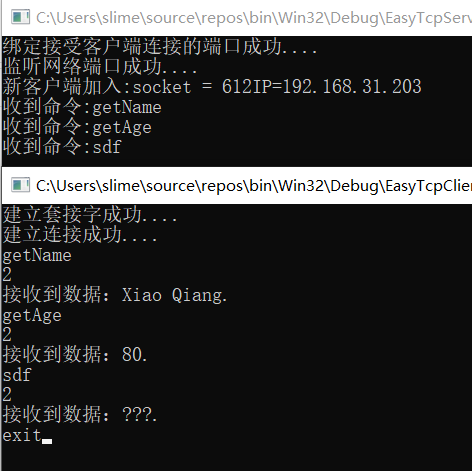
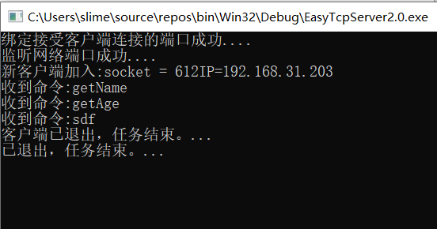

## 建立能持续处理请求的C/S网络程序

总代码：

**client**

~~~cpp
#define _CRT_SECURE_NO_WARNINGS
#define WIN32_LEAN_AND_MEAN
#include <iostream>
#include <windows.h>
#include <WinSock2.h>
#define _WINSOCK_DEPRECATED_NO_WARNINGS 0
#pragma comment(lib,"ws2_32.lib")
int main(void) {
	//启动Windows socket 2.x环境
	WORD ver = MAKEWORD(2, 2); //2.2版本
	WSADATA dat;
	WSAStartup(ver, &dat); //winsocket的启动函数 版本号
	/*****************用Socket API 建立简易TCP客户端************************/
	//1.建立一个socket
	SOCKET _sock = socket(AF_INET, SOCK_STREAM, 0);//AF_INET:IPV4
	if (INVALID_SOCKET == _sock) {
		std::cout << "error,建立套接字失败...." << std::endl;
	}
	else {
		std::cout << "建立套接字成功...." << std::endl;
	}
	//2.连接服务器 connect
	sockaddr_in _sin = {};
	_sin.sin_family = AF_INET;
	_sin.sin_port = htons(4567);
	_sin.sin_addr.S_un.S_addr = inet_addr("192.168.31.203");
	int ret = connect(_sock, (sockaddr*)&_sin, sizeof(sockaddr_in));
	if (SOCKET_ERROR == ret) {
		std::cout << "error,连接失败...." << std::endl;
	}
	else {
		std::cout << "建立连接成功...." << std::endl;
	}
	while (true) {
		//3.输入请求命令
		char cmdBuf[128] = {};
		scanf("%s",cmdBuf);
		//4.处理请求
		std::cout << 2 << std::endl;
		Sleep(300);
		if (strcmp(cmdBuf, "exit")==0) {
			std::cout << "收到退出命令，任务结束。..." << std::endl;
			break;
		}
		else {
			//5.向服务器发送请求命令
			send(_sock, cmdBuf, strlen(cmdBuf) + 1, 0);
		}
		//6.接受服务器信息 recv
		char recvBuf[256] = {};
		int nlen = recv(_sock, recvBuf, 256, 0);
		if (nlen > 0) {
			std::cout << "接收到数据：" << recvBuf << std::endl;
		}
	}
	//7.关闭socket close socket
	closesocket(_sock);
	/*****************************************************************/
	//清除Windows socket 环境
	WSACleanup();
	std::cout << "已退出，任务结束。..." << std::endl;
	getchar();
	return 0;
}
~~~

**server**

~~~cpp
#define _CRT_SECURE_NO_WARNINGS
#define WIN32_LEAN_AND_MEAN

#include <iostream>
#include <windows.h>
#include <WinSock2.h>

int main(void) {

	//启动Windows socket 2.x环境
	WORD ver = MAKEWORD(2, 2); //2.2版本
	WSADATA dat;
	WSAStartup(ver, &dat); //winsocket的启动函数 版本号
	/*****************用Socket API 建立简易TCP服务端************************/
	//1.建立一个socket(套接字)
	SOCKET _sock = socket(AF_INET, SOCK_STREAM, IPPROTO_TCP);//AF_INET:IPV4 SOCK_STREAM:面向流的socket类型 IPPROTO_TCP:TCP形式
	//2.绑定接受客户端连接的端口 bind
	sockaddr_in _sin = {};
	_sin.sin_family = AF_INET; //IPV4类型
	_sin.sin_port = htons(4567); //端口号 host to net unsigned short 将主机的数据转为网络的数据
	_sin.sin_addr.S_un.S_addr = INADDR_ANY;//服务器绑定的ip地址，一个主机可能有多个ip地址 写法1：inet_addr("192.168.31.203") 写法2：INADDR_ANY(启动所有点ip地址)
	if (bind(_sock, (sockaddr*)&_sin, sizeof(sockaddr_in)) == SOCKET_ERROR) {
		std::cout << "error,绑定接受客户端连接的端口失败...." << std::endl;
	}
	else {
		std::cout << "绑定接受客户端连接的端口成功...." << std::endl;
	}
	//3.监听网络端口 listen
	if (listen(_sock, 5) == SOCKET_ERROR) {//最大等待5个人连接
		std::cout << "error,监听网络端口失败...." << std::endl;
	}
	else {
		std::cout << "监听网络端口成功...." << std::endl;
	}
	//4.等待接受客户端连接 accept
	sockaddr_in ClientAddr = {};
	int nAddrLen = sizeof(sockaddr_in);
	SOCKET _cSock = INVALID_SOCKET;

	_cSock = accept(_sock, (sockaddr*)&ClientAddr, &nAddrLen); //当客户端连接我们的时候，我们就可以收到ClientAddr(socket数据)和nAddrLen(socket数据的长度)
	if (_cSock == INVALID_SOCKET) {
		std::cout << "warning,接受到无效客户端SOCKET...." << std::endl;
	}
	std::cout << "新客户端加入:socket = "<< _cSock <<"IP=" << inet_ntoa(ClientAddr.sin_addr) << std::endl;
	char _recvBuf[128] = {};
	while (true) {
		//5. 接受客户端数据
		int nLen = recv(_cSock, _recvBuf, 128, 0);
		if (nLen <= 0) {
			std::cout << "客户端已退出，任务结束。..." << std::endl;
			break;
		}
		std::cout << "收到命令:" << _recvBuf<< std::endl;
		//6.处理请求
		if (strcmp(_recvBuf,"getName")==0) {
			char msgBuf[] = "Xiao Qiang.";
			//7.向客户端发送一条数据send
			send(_cSock, msgBuf, strlen(msgBuf) + 1, 0);//发送给_cSock msgBuf信息 +1为结尾符
		}
		else if (strcmp(_recvBuf, "getAge")==0) {
			char msgBuf[] = "80.";
			//7.向客户端发送一条数据send
			send(_cSock, msgBuf, strlen(msgBuf) + 1, 0);//发送给_cSock msgBuf信息 +1为结尾符
		}
		else {
			char msgBuf[] = "???.";
			//7.向客户端发送一条数据send
			send(_cSock, msgBuf, strlen(msgBuf) + 1, 0);//发送给_cSock msgBuf信息 +1为结尾符
		}
		
		
	}
	//8.关闭socket close socket
	closesocket(_sock);
	/*****************************************************************/
	//清除Windows socket 环境
	WSACleanup();
	std::cout << "已退出，任务结束。..." << std::endl;
	getchar();
	return 0;
}
~~~

