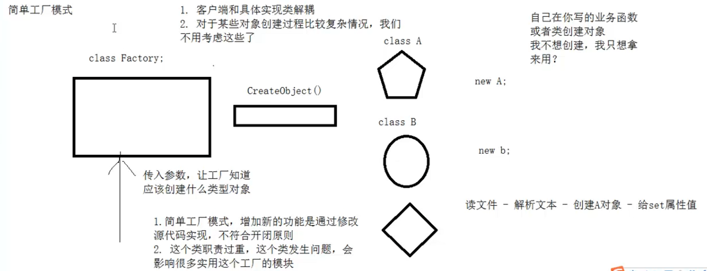
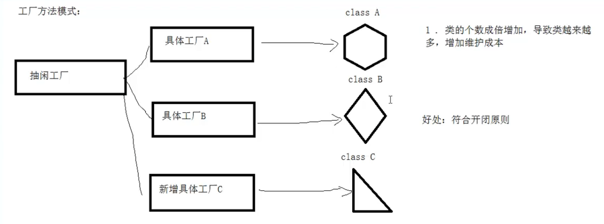
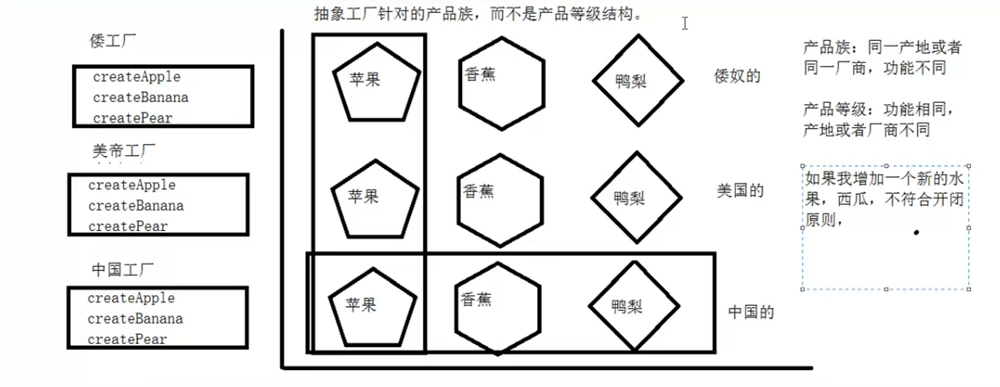

## 工厂模式

通过“对象创建”模式绕开new，来避免对象创建(new)过程中导致的紧耦合（依赖具体类），从而支持对象创建的稳定。它是接口抽象之后的第一步工作。

**动机：**在软件系统中，经常面临着创建对象的工作，由于需求的变化，需要创建的对象的具体类型经常变化。

#### 简单工厂模式：

>+ 增加新的功能是通过修改源码实现的，不利于开闭原则
>
>+ 工厂类职责过重，这个类发生问题，会影响很多使用这个工厂的模块

简单工厂模式有问题，不符合开闭原则

##### 适用场景：

1.工厂类负责创建的对象较少，由于创建的对象较少，不会造成工厂方法的业务逻辑太过复杂。

2.客户端只知道传入工厂类的参数，对于如何创建对象并不关心。

#### 工厂方法模式：

>+ 类的个数成倍增加，导致类越来越多，增加维护成本
>
>+ 好处:符合开闭原则

##### 适用场景：

1.客户端不知道它所需要的对象的类。

2.抽象工厂类通过其子类来指定创建哪个对象。

#### 抽象工厂模式

将水果工厂都抽象