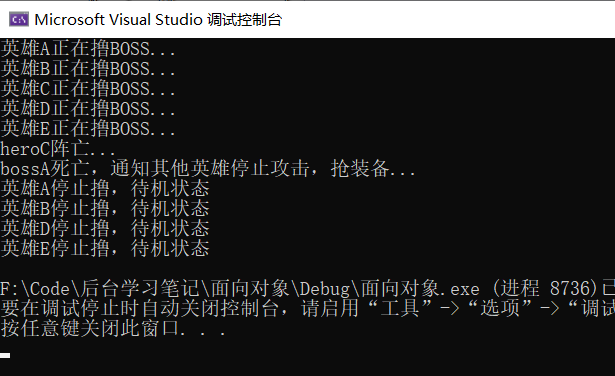

## Observer观察者模式

定义对象间的一种一对多(变化)的依赖关系，以便当一个对象(Subject)的状态发生改变时，所有的依赖于它的对象都得到通知并自动更新。 

动机：在软件构建的过程中，我们需要为某些对象建立一种“通知依赖关系”。一个对象（目标对象）的状态发生改变，所有的依赖对象（观察对象）都将得到通知，如果这样的依赖关系过于亲密，将使软件不能很好的抵御变化。

使用面向对象的抽象，Observer模式使我们可以独立地改变目标与观察者，从而使二者之间的依赖关系达至松耦合。

目标发送通知时，无需指定观察者，通知（可以携带通知信息作为参数）会自动传播。

观察者自己决定是否需要订阅通知，目标对象对此一无所知。

Observer模式是基于事件的UI框架中非常常用的设计模式，也是MVC模式的一个重要的组成部分。

举例：

很多个英雄打BOSS
BOSS状态(目标对象) 活着 英雄状态(观察者)-攻击状态
BOSS状态(目标对象) 死亡 英雄状态(观察者)-待机状态
换个BOSS也可以继续实现上面的状态

#### 代码实现

先创建抽象观察者

~~~cpp
//抽象的英雄
class AbstractHero {
public:
	virtual void Update() = 0;

};
~~~

再创建具体观察者

~~~cpp
//具体的英雄，具体的观察者
class HeroA : public AbstractHero {
public:
	HeroA() {
		cout << "英雄A正在撸BOSS..."<<endl;
	}
	virtual void Update() {
		cout << "英雄A停止撸，待机状态" << endl;
	}
};

class HeroB : public AbstractHero {
public:
	HeroB() {
		cout << "英雄B正在撸BOSS..."<<endl;
	}
	virtual void Update() {
		cout << "英雄B停止撸，待机状态" << endl;
	}
};

class HeroC : public AbstractHero {
public:
	HeroC() {
		cout << "英雄C正在撸BOSS..."<<endl;
	}
	virtual void Update() {
		cout << "英雄C停止撸，待机状态" << endl;
	}
};

class HeroD : public AbstractHero {
public:
	HeroD() {
		cout << "英雄D正在撸BOSS..." << endl;
	}
	virtual void Update() {
		cout << "英雄D停止撸，待机状态" << endl;
	}
};

class HeroE : public AbstractHero {
public:
	HeroE() {
		cout << "英雄E正在撸BOSS..." << endl;
	}
	virtual void Update() {
		cout << "英雄E停止撸，待机状态" << endl;
	}
};
~~~

创建抽象的目标对象

~~~cpp
//观察目标抽象
class AbstractBoss {
public:
	//添加观察者
	virtual void addHero(AbstractHero* Hero)=0;
	//删除观察者
	virtual void deleteHero(AbstractHero* Hero)=0;
	//通知所有观察者
	virtual void notify() = 0;
};
~~~

创建具体的目标对象

~~~cpp
class BOSSA : public AbstractBoss {
public:
	//添加观察者
	virtual void addHero(AbstractHero* Hero) {
		pHeroList.push_back(Hero);
	}
	//删除观察者
	virtual void deleteHero(AbstractHero* Hero) {
		pHeroList.remove(Hero);
	}
	//通知所有观察者
	virtual void notify() {
		for (list<AbstractHero*>::iterator it = pHeroList.begin(); it != pHeroList.end();it++) {
			(*it)->Update();
		}
	}
public:
	list<AbstractHero*> pHeroList;
};

~~~

测试：

~~~cpp
void test01() {
	//创建观察者
	AbstractHero* heroA = new HeroA;
	AbstractHero* heroB = new HeroB;
	AbstractHero* heroC = new HeroC;
	AbstractHero* heroD = new HeroD;
	AbstractHero* heroE = new HeroE;
	//创建观察目标
	AbstractBoss* boosA = new BOSSA;
	boosA->addHero(heroA);
	boosA->addHero(heroB);
	boosA->addHero(heroC);
	boosA->addHero(heroD);
	boosA->addHero(heroE);

	cout << "heroC阵亡..." << endl;
	boosA->deleteHero(heroC);

	cout << "bossA死亡，通知其他英雄停止攻击，抢装备..." << endl;
	boosA->notify();

}
~~~

得到结果：

